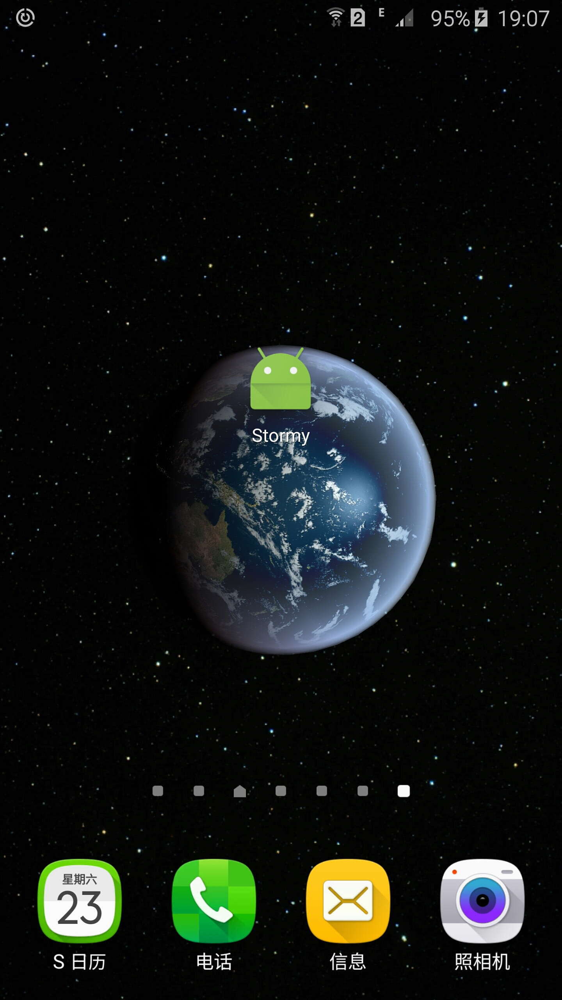

### 这里存放学安卓的代码和笔记 (倒序排列, 最新的放最上面)


<br/>
### 6. 上线 Google Play
    钱: 要给 Google 25 美金.
    审核:  不像 Apple 需要审核, Google Play 可以直接上线.
    如果是 Google Play 付费APP: 要申请个什么 Wallet Account.


<br/>
### 5. Android Activity Lifecycle
基于 Fun Fact 之上改进的

讲了:

    1. 当竖屏切换到横屏的时候, Activity 会重新创建, 所以必须保存状态, 然后恢复
    http://developer.android.com/training/basics/activity-lifecycle/recreating.html

    用 onSaveInstanceState 保存状态
        outState.putString(KEY, VALUE);
        outState.putInt(KEY, VALUE);

    用 onRestoreInstanceState 恢复状态
        savedInstanceState.getString(KEY,VALUE);
        savedInstanceState.getInt(KEY,VALUE);


<br/>
### 4. 改进 Stormy  - 用列表显示天气数据
课程名: Android Lists and Adapters




讲了:

    1. Adapter 的简单应用和自定义 Adapter
        不过我没完全理解

    2. implements Parcelable
        数据打包什么的, 我在这里也没理解

    3. RecyclerView
        要去 build.gradle 的 dependencies 里加一行    compile 'com.android.support:recyclerview-v7:23.1.1'

        <android.support.v7.widget.RecyclerView
        android:layout_width="match_parent"
        android:layout_height="match_parent"
        android:id="@+id/reyclerView"/>


<br/>
### 3. Stormy (天气信息)
课程名: Build a Weather App


讲了:

    1. 什么是 API
    2. UI 线程, 后台线程. 耗时的, 和界面无关的任务都放到后台线程里去做, 不然界面就卡住不动了.
    3. 第三方库怎么用 (去 build.gradle 里的 dependenices 里添加一行就好)
    4. 第三方库 OkHttp (网络请求库)
    5. 第三方库 ButterKnife @Bind(R.id.xxx) (TextView) mTimeLabel;   Butterknife.bind(this);
    6. 系统弹窗怎么做  AlertDialogFragment extends DialogFragment
    7. JSON 解析 ( JSONObject )
    8. SimpleDataFormat 处理时间戳.

        ```
        SimpleDateFormat formatter = new SimpleDateFormat("EEEE");
        formatter.setTimeZone(TimeZone.getTimeZone(mTimezone));
        Date dateTime = new Date(mTime * 1000);
        return formatter.format(dateTime);
        ```

    9. layout:weight  在上级元素中占据的宽度比例
    10. gravity  对齐
    11. runOnUiThread(new Runnable() { .... })


<br/>
### 2. Interactive Story (飞船故事)
课程名:《Build an Interactive Story App》  <br/>

官方的设计稿: <br/>


玩法是一开始让你输入一个名字, 然后进入一个故事, 每个故事有2个按钮, 然后进到不同的故事 <br/>
真机测试的截图(我汉化了下)<br/>


这个课是第 2 篇, 用了 2 个 Activity,  <br/>
讲了:

    1. @Override 不是必写的, 但是写了更好, 表明了你要覆盖掉父类的一个方法,
    如果你不小心写错大小写, 导致和父类想覆盖的那个方法名字不一样, 比如 i 和 l, 肉眼难辨认, 可能就会导致问题
    2. Activity 之间怎么切换 (Intent)
    3. 切换 Activity 时怎么传递数据 ( Intent.putExtra() )
    4. MVC 的概念: 用了游戏主机的手柄比喻 Controller, 游戏主机比作 Model, 显示器比作 View
    5. 在 APP 中实际用 MVC 来让代码更好理解和维护
        建 package, 名字叫 model, ui, 等等


<br/>
### 1. Fun Facts (有趣冷知识)
课程名: 《Build a Simple Android App》<br/>
FunFacts/ 是 TreeHouse Android 系列教程的第 1 篇<br/>
进入 APP 后，点击按钮，切换不同的有趣的冷知识. 下面是真机测试截图<br/>


讲了:

    1. Android Studio 怎么用(在 Project 视图和 Android 视图间切换)
    2. 模拟器在哪里开
    3. 怎么去掉顶部的 Action Bar (res/values/styles.xml) parent="Theme.AppCompat.Light.NoActionBar"
    4. strings.xml 是什么 (1.便于多语言 2.避免重复在代码里写死文字)
    5. findViewById 通过 ID 找 View.
    6. OnClickListener 监听点击事件
    7. Random 生成随机数.  Random random = new Random(); random.nextInt(10);
    8. Toast 就是屏幕下方出现的黑色背景小提示框
        Toast.makeText(this, 文字在此, Toast.LENGTH_LONG).show();
    9. 怎么改 APP ICON
        res/mipmap/ic_launcher.png


#### 学习资料来源

    Treehouse 的安卓教程 (https://teamtreehouse.com)

(一开始看的是 Udacity 的安卓教程，做的是个天气 APP，后来忘记因为什么原因实在跟不下去就放弃了)


#### 环境

    Windows 10 x64
    Android Studio 1.5.1
    Sumsung Note 5 真机调试 (Android 5.1)


#### 推荐资料

    什么是 Bundle?
    http://stackoverflow.com/questions/4999991/what-is-a-bundle-in-an-android-application
        Bundle 用于不同 Activity 之间传递数据


#### 文件夹

    FunFacts/  有趣冷知识 APP
    InteractiveStory/ 太空探险故事 APP
    Stormy/  今日天气 APP
    StormyList/ 今日天气 + 今天的每小时天气(列表) + 本周每天的天气(列表)
    zImage/ 跟安卓无关, 只是 README 里需要用到的图片