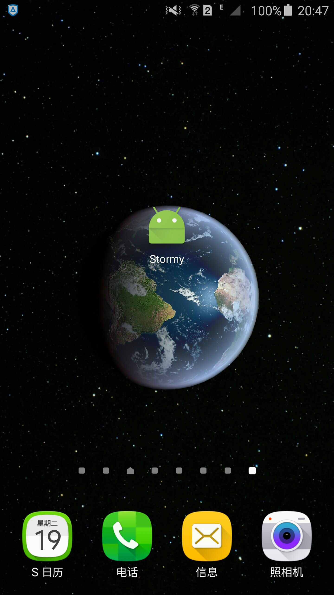

### 这里存放我学安卓的代码

#### 学习资料来源

    Treehouse 的安卓教程

#### 环境:

    Windows 10 x64
    Android Studio 1.5.1
    Sumsung Note 5 真机调试 (Android 5.1)

### Fun Facts (有趣冷知识)
课程名: 《Build a Simple Android App》 
FunFacts/ 是 TreeHouse Android 系列教程的第 1 篇 
进入 APP 后，点击按钮，切换不同的有趣的冷知识. 下面是真机测试截图 

讲了:

    Android Studio 怎么用(在 Project 视图和 Android 视图间切换)
    模拟器在哪里开
    怎么去掉顶部的 Action Bar,
    strings.xml 是什么
    findViewById 通过 ID 找 View,
    OnClickListener事件监听,
    Random 生成随机数,
    Toast是什么

 
### Interactive Story (飞船故事)
课程名:《Build an Interactive Story App》   

官方的设计稿:  

玩法是一开始让你输入一个名字, 然后进入一个故事, 每个故事有2个按钮, 然后进到不同的故事  
真机测试的截图(我汉化了下) 

这个课是第 2 篇, 用了 2 个 Activity,   
讲了:

    @Override 不是必写的, 但是写了更好
    Activity 之间怎么切换 (用 Intent)
    切换 Activity 时怎么传递数据 (用 Intent)
    MVC 的概念: 用了游戏主机的手柄比喻 Controller, 游戏主机比作 Model, 显示器比作 View
    在 APP 中实际用 MVC 来让代码更好理解和维护

 
### Stormy (天气信息)
课程名: Build a Weather App

讲了:

    什么是 API
    UI 线程, 后台线程
    第三方库 OkHttp
    系统弹窗怎么做  AlertDialogFragment extends DialogFragment
    JSON 解析  JSONObject
    SimpleDataFormat 处理时间戳
    layout:weight  比例
    gravity  对齐
    第三方库 ButterKnife @Bind
    runOnUiThread(new Runnable() { .... })

 
### 改进 Stormy  - 用列表显示数据
课程名: Android Lists and Adapters

 
### Android Activity Lifecycle

