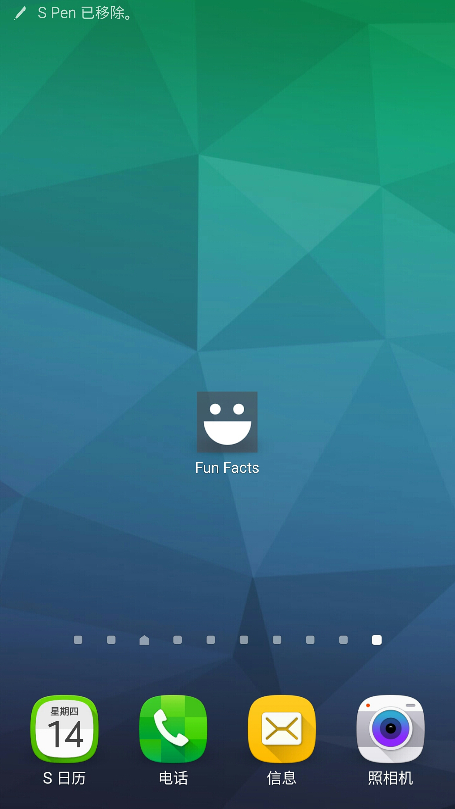
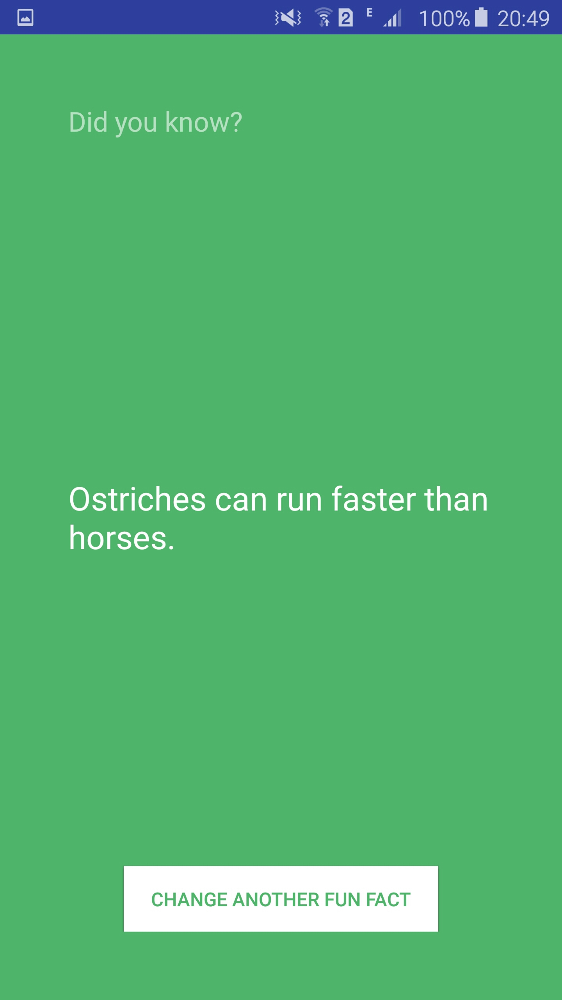
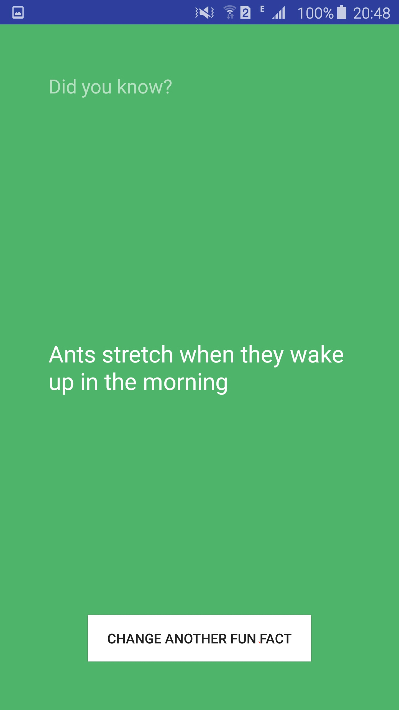

### 学安卓的代码存这边

环境:

    Windows 10
    Android Studio 1.5.1
    Sumsung Note 5 真机调试(Android 5.1)

FunFacts/ 是 TreeHouse Android 教程的第一篇(Build a Simple Android App)教的 APP
只有一个界面, 就一个按钮和一些文字
进入 APP 之后，点击按钮，告诉你有趣的冷知识
(文字变了, 背景颜色变了)

